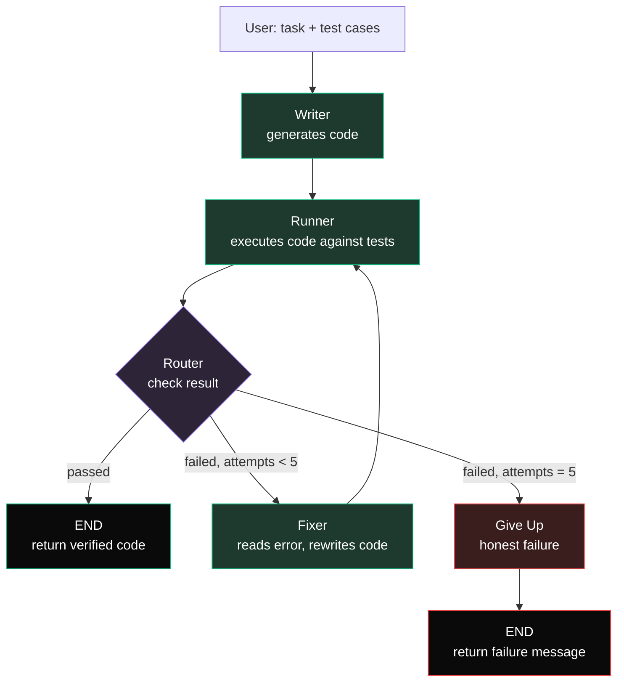

# Patchwork

**Self-correcting code generation — it writes code, runs it against tests to verify it actually works, fixes its own mistakes, and stops honestly when it can't.**

[Live Demo](https://patchwork-hazel.vercel.app) · [Backend API](https://patchwork-9lfw.onrender.com/docs)

---

## What it is

Most "AI writes code" tools hand you output you have to trust. Patchwork doesn't ask you to trust it — it **verifies**.

You give it a coding task in plain English **and the test cases that define "correct."** Patchwork writes code, executes it against those tests, and if the code fails, it reads its own error, rewrites the code, and tries again — looping until the code passes or it hits a retry limit and stops honestly instead of returning something broken.

This is the **generate–test–repair loop** that powers tools like Claude Code and Cursor's agents, built from scratch to understand the reliability mechanism end to end.

## Why it's interesting

The valuable thing in AI right now isn't "AI writes code" — everyone has that. It's **reliability**: output you can actually trust. Patchwork demonstrates three ideas that make that real:

- **Verified, not just generated.** A single LLM generation gives you no signal about whether *this particular* output is correct. Patchwork executes the code against tests, turning "probably right" into "proven right — or proven broken and being repaired."
- **The human defines correctness.** Test cases are provided by the user, not generated by the model. This sidesteps the "AI grading its own homework" problem — correctness is anchored to an external standard, not the model's own guess at what you meant.
- **Honest failure.** If the loop can't solve the task within its retry limit, it stops and says so, rather than handing back plausible-looking broken code.

## Architecture

Patchwork is a **multi-agent system built in LangGraph**. Three agents share a single state object and are wired together with conditional routing and a bounded repair loop.



**Agents**
- **Writer** — turns the plain-English task into code (temperature `0` for the most confident first attempt).
- **Runner** — executes the code against the user's tests and reports `passed` or the captured error.
- **Fixer** — reads the error and the broken code, rewrites it, and increments the attempt counter (temperature `0.3` to escape repeating a failing approach).

**Shared state** — a typed `FixerState` dictionary (`task`, `tests`, `code`, `result`, `attempts`) passed between every node.

**The loop** — `Writer → Runner → (router) → Fixer → Runner → …` until the code passes or the attempt limit (5) is reached, at which point it routes to an honest failure.

## Tech Stack

**Backend / Engine**
- Python — the engine, hand-written end to end
- LangGraph — multi-agent orchestration (nodes, conditional edges, repair loop)
- Anthropic Claude API — Writer and Fixer agents (`claude-haiku-4-5`)
- FastAPI — `/solve` REST endpoint
- Uvicorn — ASGI server
- Pydantic — request validation
- python-dotenv — environment/secret loading

**Execution / Sandboxing**
- Docker — isolated, network-disabled container for running untrusted generated code
- subprocess (stdlib) — timeout-bounded fallback execution path
- `USE_DOCKER` environment switch — selects sandbox (local) vs. subprocess (hosted)

**Frontend**
- React + Vite — UI and build tooling
- JavaScript
- Custom CSS — dark theme
- Fetch API — backend communication

**Deployment / Infra**
- Render — backend hosting
- Vercel — frontend hosting
- CORS middleware — cross-origin config between deployed frontend and backend
- Git / GitHub — version control

## Running locally

**Prerequisites:** Python 3.11+, Node.js, Docker Desktop (for local sandboxing), and an Anthropic API key.

**1. Backend**

```bash
# from the project root
python -m venv venv
source venv/bin/activate
pip install -r requirements.txt
```

Create a `.env` file in the project root:

```
ANTHROPIC_API_KEY=sk-ant-your-key-here
```

Build the sandbox image (required before the Docker execution path will work):

```bash
docker build -t patchwork-sandbox backend/
```

Run the API. Set `USE_DOCKER=true` to execute generated code inside the Docker sandbox:

```bash
USE_DOCKER=true uvicorn backend.api:api --reload
```

The API runs at `http://localhost:8000` (interactive docs at `/docs`).

**2. Frontend**

```bash
cd frontend
npm install
npm run dev
```

The app runs at `http://localhost:5173`.

## Usage

Provide a task and **test cases as Python `assert` statements** (one per line):

**Task**
```
Write a function called two_sum(nums, target) that returns the indices
of the two numbers that add up to target as a list [i, j].
```

**Test Cases**
```python
assert two_sum([2, 7, 11, 15], 9) == [0, 1]
assert two_sum([3, 2, 4], 6) == [1, 2]
```

Patchwork generates the code, verifies it against your tests, repairs it if needed, and returns the final code, the result, and the number of repair attempts.

## Design decisions & tradeoffs

- **Code generation over SQL.** "AI that writes and fixes its own code" is the stronger, more general demonstration of the reliability loop.
- **Human-provided tests.** The user defines correctness. AI-generated edge-case tests are a possible future upgrade, but keeping the human in the loop is what makes the verification trustworthy.
- **Docker locally, subprocess in production.** Running AI-generated code is the one genuinely unsafe part of the system. Locally it runs in a Docker container with `--network none`, so untrusted code is isolated from the host and can't reach the internet. The hosted demo runs on Render, which can't nest Docker, so it falls back to a subprocess with a timeout. A production deployment would run the sandbox on a dedicated container host rather than fall back.
- **Bounded retries (5).** The repair loop has diminishing returns — most fixable bugs are caught in the first one or two attempts — so the loop is capped and fails honestly rather than burning calls on a problem the model is stuck on.

## Possible extensions

- AI-suggested test cases (with human review) to reduce manual test-writing
- A diff view showing what the Fixer changed on each attempt
- Multi-language support beyond Python
